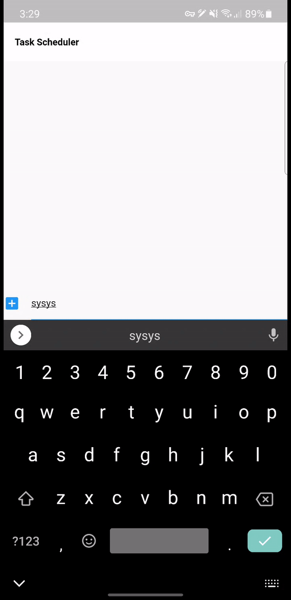

# cached_grinz_alpha

A Flutter application to save, delete and rearrange tasks with lightning fast speed with added vibration feedback and sanity check.

# App Demo

For help getting started with Flutter, view our
[online documentation](https://flutter.dev/docs), which offers tutorials,
samples, guidance on mobile development, and a full API reference.
